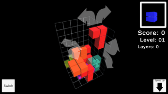

# 3D Random Terrain Generation

This project is a recreation of the classic Tetris game using the Unity engine, but in 3D. It brings a new dimension to the timeless puzzle game, adding depth and a fresh challenge.



## Try It Out

You can try the project [here]([https://hk-studio.itch.io/tetris-3d]).

## Features

- Classic Tetris gameplay in a 3D environment.
- Intuitive controls and smooth animations.
- Challenging and addictive gameplay.

## How to Run

1. Clone the repository:
   ```sh
   git clone https://github.com/hussienK/unity-Tetris-3d.git
   cd unity-Tetris-3d.
2. Open the project in Unity:
   ```sh
   - Launch the Unity Hub.
   - Add the project to your Unity Hub.
   - Open the project in the Unity Editor.
3. Play the scene:
   ```sh
   - In the Unity Editor, open the main scene.
   - Click the "Play" button to start the game.
Or try the executable from the website

## Contribution

Contributions are welcome! If you have suggestions or improvements, feel free to open an issue or submit a pull request.
